# Consul 3-Node Cluster Deployment Flow

## High-Level Flow Diagram

```mermaid
graph TD
    Start([User: deploy.sh consul-cluster.yaml]) --> LoadConfig[Load YAML Config]
    LoadConfig --> ValidateConfig{Validate<br/>Config?}

    ValidateConfig -->|Invalid| Fail1[Exit with Error]
    ValidateConfig -->|Valid| CheckDB[Connect to Database]

    CheckDB --> FetchArtifact[Fetch Artifact Info<br/>artifact_id: CONSUL_V1]
    FetchArtifact --> CheckPublished{Artifact<br/>Published?}

    CheckPublished -->|No| Fail2[Error: Artifact Not Published]
    CheckPublished -->|Yes| GetArtifactPath[Get Container Image Path<br/>consul-v1.tar.gz]

    GetArtifactPath --> ImportImage[Import LXC Image<br/>lxc image import]
    ImportImage --> CreateAlias[Create Image Alias<br/>consul-v1]

    CreateAlias --> StartNode1[Deploy Node 1]

    StartNode1 --> Node1Process[["Node 1 Deployment<br/>────────────<br/>1. Create container<br/>2. Set environment vars<br/>3. Start container<br/>4. Get IP address<br/>5. Create consul.json<br/>6. Start Consul service"]]

    Node1Process --> CheckNode1{Node 1<br/>Healthy?}
    CheckNode1 -->|No| Rollback1[Rollback Node 1]
    CheckNode1 -->|Yes| RecordNode1[Record Node 1 IP<br/>10.10.199.117]

    RecordNode1 --> StartNode2[Deploy Node 2]

    StartNode2 --> Node2Process[["Node 2 Deployment<br/>────────────<br/>1. Create container<br/>2. Set environment vars<br/>3. Set RETRY_JOIN=Node1:8301<br/>4. Start container<br/>5. Get IP address<br/>6. Create consul.json<br/>7. Start Consul service"]]

    Node2Process --> CheckNode2{Node 2<br/>Healthy?}
    CheckNode2 -->|No| Rollback2[Rollback Nodes 1-2]
    CheckNode2 -->|Yes| RecordNode2[Record Node 2 IP<br/>10.10.199.62]

    RecordNode2 --> StartNode3[Deploy Node 3]

    StartNode3 --> Node3Process[["Node 3 Deployment<br/>────────────<br/>1. Create container<br/>2. Set environment vars<br/>3. Set RETRY_JOIN=Node1:8301,Node2:8311<br/>4. Start container<br/>5. Get IP address<br/>6. Create consul.json<br/>7. Start Consul service"]]

    Node3Process --> CheckNode3{Node 3<br/>Healthy?}
    CheckNode3 -->|No| Rollback3[Rollback All Nodes]
    CheckNode3 -->|Yes| WaitCluster[Wait for Cluster Formation<br/>~10 seconds]

    WaitCluster --> VerifyCluster[Verify Cluster]

    VerifyCluster --> CheckMembers{consul members<br/>shows 3 nodes?}
    CheckMembers -->|No| RetryJoin[Retry Join<br/>Max 3 attempts]
    CheckMembers -->|Yes| CheckLeader{Leader<br/>Elected?}

    RetryJoin --> CheckMembers

    CheckLeader -->|No| WaitLeader[Wait for Election<br/>Max 30s]
    CheckLeader -->|Yes| HealthChecks[Run Health Checks]

    WaitLeader --> CheckLeader

    HealthChecks --> AllHealthy{All Nodes<br/>Healthy?}
    AllHealthy -->|No| Rollback4[Rollback Deployment]
    AllHealthy -->|Yes| RecordSuccess[Record Deployment Success<br/>in Database]

    RecordSuccess --> Success([Cluster Ready<br/>Nodes: 8500, 8510, 8520])

    Rollback1 --> Cleanup[Clean Up Resources]
    Rollback2 --> Cleanup
    Rollback3 --> Cleanup
    Rollback4 --> Cleanup
    Cleanup --> Fail3[Deployment Failed]
```



## Detailed Deployment Sequence

### Phase 1: Preparation
```
┌─────────────────────────────────────┐
│  1. User executes:                  │
│     ./deploy.sh consul-cluster.yaml │
└──────────────┬──────────────────────┘
               ▼
┌─────────────────────────────────────┐
│  2. Load consul-cluster.yaml        │
│     - type: multi-instance          │
│     - artifact_id: CONSUL_V1        │
│     - 3 instances defined           │
└──────────────┬──────────────────────┘
               ▼
┌─────────────────────────────────────┐
│  3. Database Query                  │
│     SELECT * FROM artifacts         │
│     WHERE artifact_id='CONSUL_V1'   │
│     AND published=true              │
└──────────────┬──────────────────────┘
               ▼
┌─────────────────────────────────────┐
│  4. Retrieved:                      │
│     - path: consul-v1.tar.gz        │
│     - version: v1                   │
│     - checksum: abc123...           │
└─────────────────────────────────────┘
```

### Phase 2: Node Deployment
```
┌─────────────────────────────────────────────┐
│             NODE 1 DEPLOYMENT               │
├─────────────────────────────────────────────┤
│  lxc image import consul-v1.tar.gz         │
│  lxc image alias create consul-v1          │
│  lxc init consul-v1 consul-node-1          │
│  lxc config set environment variables      │
│  lxc start consul-node-1                   │
│  IP: 10.10.199.117                         │
│  Create /consul/config/consul.json:        │
│    {                                        │
│      "node_name": "consul-node-1",         │
│      "ports": {                            │
│        "http": 8500,                       │
│        "serf_lan": 8301                    │
│      },                                     │
│      "bootstrap_expect": 3                 │
│    }                                        │
│  rc-service consul start                   │
└──────────────────┬──────────────────────────┘
                   ▼
┌─────────────────────────────────────────────┐
│             NODE 2 DEPLOYMENT               │
├─────────────────────────────────────────────┤
│  lxc init consul-v1 consul-node-2          │
│  lxc config set environment variables      │
│  lxc start consul-node-2                   │
│  IP: 10.10.199.62                          │
│  Create /consul/config/consul.json:        │
│    {                                        │
│      "node_name": "consul-node-2",         │
│      "ports": {                            │
│        "http": 8510,                       │
│        "serf_lan": 8311                    │
│      },                                     │
│      "retry_join": ["10.10.199.117:8301"] │
│      "bootstrap_expect": 3                 │
│    }                                        │
│  rc-service consul start                   │
└──────────────────┬──────────────────────────┘
                   ▼
┌─────────────────────────────────────────────┐
│             NODE 3 DEPLOYMENT               │
├─────────────────────────────────────────────┤
│  lxc init consul-v1 consul-node-3          │
│  lxc config set environment variables      │
│  lxc start consul-node-3                   │
│  IP: 10.10.199.198                         │
│  Create /consul/config/consul.json:        │
│    {                                        │
│      "node_name": "consul-node-3",         │
│      "ports": {                            │
│        "http": 8520,                       │
│        "serf_lan": 8321                    │
│      },                                     │
│      "retry_join": ["10.10.199.117:8301", │
│                     "10.10.199.62:8311"]   │
│      "bootstrap_expect": 3                 │
│    }                                        │
│  rc-service consul start                   │
└─────────────────────────────────────────────┘
```

### Phase 3: Cluster Formation
```
┌─────────────────────────────────────────────┐
│           CLUSTER FORMATION                 │
├─────────────────────────────────────────────┤
│  Wait 10 seconds for nodes to discover      │
│                                             │
│  Node 2 → Joins Node 1                     │
│  Node 3 → Joins Node 1 & 2                 │
│                                             │
│  Raft Leader Election:                     │
│    - Nodes negotiate                       │
│    - Node 1 elected as leader              │
│    - Nodes 2 & 3 become followers          │
└──────────────────┬──────────────────────────┘
                   ▼
┌─────────────────────────────────────────────┐
│            VERIFICATION                     │
├─────────────────────────────────────────────┤
│  consul members:                            │
│    consul-node-1  10.10.199.117:8301 alive │
│    consul-node-2  10.10.199.62:8311  alive │
│    consul-node-3  10.10.199.198:8321 alive │
│                                             │
│  consul operator raft list-peers:          │
│    consul-node-1  LEADER                   │
│    consul-node-2  FOLLOWER                 │
│    consul-node-3  FOLLOWER                 │
└──────────────────┬──────────────────────────┘
                   ▼
┌─────────────────────────────────────────────┐
│          DATABASE UPDATE                    │
├─────────────────────────────────────────────┤
│  INSERT INTO deployments VALUES (           │
│    deployment_id: 'abc-123',               │
│    artifact_id: 'CONSUL_V1',               │
│    status: 'success',                      │
│    nodes: 3,                               │
│    completed_at: NOW()                     │
│  )                                          │
└─────────────────────────────────────────────┘
```

## Error Handling Flow

```
┌──────────────────┐
│  Node X Fails    │
└────────┬─────────┘
         ▼
┌──────────────────────────┐
│  Check Rollback Policy   │
│  strategy: all-or-nothing│
└────────┬─────────────────┘
         ▼
┌──────────────────────────┐
│  Stop All Deployed Nodes │
│  lxc stop consul-node-*  │
└────────┬─────────────────┘
         ▼
┌──────────────────────────┐
│  Delete All Containers   │
│  lxc delete consul-node-*│
└────────┬─────────────────┘
         ▼
┌──────────────────────────┐
│  Update Database         │
│  status = 'failed'       │
└────────┬─────────────────┘
         ▼
┌──────────────────────────┐
│  Notify User             │
│  Exit with Error Code    │
└──────────────────────────┘
```

## Key Decision Points

1. **Artifact Published?** - Prevents deployment of unpublished artifacts
2. **Each Node Healthy?** - Validates each node before proceeding
3. **Cluster Formed?** - Ensures all nodes joined successfully
4. **Leader Elected?** - Confirms Raft consensus is working
5. **Health Checks Pass?** - Final validation before marking success

## Configuration Used

```yaml
deployment:
  type: "multi-instance"

artifact:
  artifact_id: "CONSUL_V1"

targets:
  - instances:
      - name: "consul-node-1"
        params:
          port: 8500
          serf_lan_port: 8301
      - name: "consul-node-2"
        params:
          port: 8510
          serf_lan_port: 8311
          retry_join: ["${node-1.ip}:8301"]
      - name: "consul-node-3"
        params:
          port: 8520
          serf_lan_port: 8321
          retry_join: ["${node-1.ip}:8301", "${node-2.ip}:8311"]
```