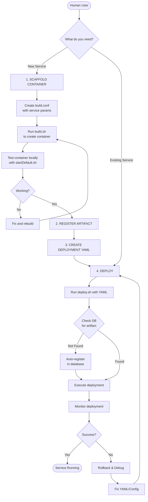

# Human Workflow: From Container Scaffolding to Deployment

## Complete Workflow Diagram



## Step-by-Step Human Workflow

### PHASE 1: SCAFFOLD NEW CONTAINER
```
┌────────────────────────────────────────────┐
│  User Action: Request container scaffold   │
│  Command: "scaffold a consul container"    │
└────────────┬───────────────────────────────┘
             ▼
┌────────────────────────────────────────────┐
│  AI Creates: build/build.conf              │
│  User Fills: Version, paths, ports         │
└────────────┬───────────────────────────────┘
             ▼
┌────────────────────────────────────────────┐
│  AI Generates:                             │
│  - build/build.sh                          │
│  - launchConsul.sh                         │
│  - templates/sample.conf                   │
│  - README.md                                │
└────────────┬───────────────────────────────┘
             ▼
┌────────────────────────────────────────────┐
│  User Runs: cd build && ./build.sh         │
│  Output: consul-v1.tar.gz (64MB)           │
└────────────┬───────────────────────────────┘
             ▼
┌────────────────────────────────────────────┐
│  User Tests: cd generated && ./startDefault.sh │
│  Verify: 3 nodes running, cluster formed   │
└────────────────────────────────────────────┘
```

### PHASE 2: CREATE DEPLOYMENT CONFIG
```
┌────────────────────────────────────────────┐
│  User Creates: deployment/consul.yaml      │
│                                            │
│  deployment:                               │
│    name: "consul-cluster"                  │
│    type: "multi-instance"                  │
│                                            │
│  artifact:                                 │
│    name: "consul"                          │
│    version: "v1"                           │
│    path: ".../consul-v1.tar.gz"           │
│                                            │
│  targets:                                  │
│    - instances:                            │
│        - name: "consul-node-1"             │
│          params: {...}                     │
│        - name: "consul-node-2"             │
│          params: {...}                     │
│        - name: "consul-node-3"             │
│          params: {...}                     │
└────────────────────────────────────────────┘
```

### PHASE 3: DEPLOY TO ENVIRONMENT
```
┌────────────────────────────────────────────┐
│  User Runs: ./deploy.sh consul.yaml        │
└────────────┬───────────────────────────────┘
             ▼
┌────────────────────────────────────────────┐
│  System Flow:                              │
│  1. Read YAML config                       │
│  2. Connect to orchestrix DB               │
│  3. Check artifacts table                  │
│  4. Register if needed                     │
│  5. Deploy containers                      │
│  6. Record in deployments table            │
└────────────┬───────────────────────────────┘
             ▼
┌────────────────────────────────────────────┐
│  Output:                                   │
│  ✓ consul-node-1 running on :8500         │
│  ✓ consul-node-2 running on :8510         │
│  ✓ consul-node-3 running on :8520         │
│  ✓ Cluster formed with 3 members          │
│  ✓ Deployment ID: abc-123-def             │
└────────────────────────────────────────────┘
```

## Quick Reference Commands

### For New Service (Full Workflow):
```bash
# 1. Scaffold
Request: "scaffold a go-id container"
cd images/containers/lxc/go-id/build
./build.sh

# 2. Test locally
cd ../go-id-v.1/generated
./startDefault.sh

# 3. Create deployment config
cat > deployment/go-id.yaml <<EOF
deployment:
  name: "go-id-service"
  type: "single"
artifact:
  name: "go-id"
  version: "v1"
  path: "images/containers/lxc/go-id/go-id-v.1/generated/artifact/go-id-v1.tar.gz"
targets:
  - instances:
      - name: "go-id-main"
        params:
          port: 7080
EOF

# 4. Deploy
cd deployment
./deploy.sh go-id.yaml
```

### For Existing Service (Deploy Only):
```bash
# Just deploy with existing YAML
cd deployment
./deploy.sh consul-cluster.yaml
```

## Decision Tree for Users

```
Q: Do you have a container image?
├─ NO → Start with SCAFFOLD
│   └─ Follow Phase 1 → Phase 2 → Phase 3
└─ YES → Do you have a deployment YAML?
    ├─ NO → Create YAML (Phase 2)
    │   └─ Then deploy (Phase 3)
    └─ YES → Deploy directly (Phase 3)
        └─ Run: ./deploy.sh your-config.yaml
```

## File Organization

```
orchestrix/
├── images/containers/lxc/                    # Scaffolded containers
│   ├── consul/
│   │   ├── build/
│   │   │   ├── build.conf        # Build configuration
│   │   │   └── build.sh          # Build script
│   │   └── consul-v.1/
│   │       └── generated/
│   │           ├── artifact/      # Container images
│   │           │   └── consul-v1.tar.gz
│   │           └── startDefault.sh # Local test script
│   │
│   └── go-id/                    # Another service
│       └── (same structure)
│
├── deployment/                    # Deployment configs
│   ├── deploy.sh                 # Main deployment script
│   ├── consul-cluster.yaml       # Consul deployment
│   └── go-id.yaml               # Go-ID deployment
│
└── automation/api/deployment/    # Java deployment engine
    └── SimpleDeploymentManager.java

```

## Database Tables (Auto-Created)

```sql
-- Artifacts table (tracks all containers/binaries)
artifacts:
  - artifact_name: "consul"
  - artifact_version: "v1"
  - artifact_path: ".../consul-v1.tar.gz"
  - published: true
  - publish_date: 2024-10-07

-- Deployments table (tracks all deployments)
deployments:
  - deployment_id: "abc-123"
  - artifact_name: "consul"
  - deployment_type: "multi-instance"
  - status: "success"
  - started_at: 2024-10-07 10:00:00
```

## Common Scenarios

### 1. Deploy Consul Cluster (3 nodes, same machine)
```bash
./deploy.sh consul-cluster.yaml
```

### 2. Deploy Single Go-ID Service
```bash
./deploy.sh go-id.yaml
```

### 3. Check Deployment Status
```bash
mysql -h 127.0.0.1 -u root -p123456 orchestrix \
  -e "SELECT * FROM deployments ORDER BY started_at DESC LIMIT 5"
```

### 4. Check Available Artifacts
```bash
mysql -h 127.0.0.1 -u root -p123456 orchestrix \
  -e "SELECT artifact_name, artifact_version, published FROM artifacts"
```

## Future UI Integration

When the web UI is ready, it will:
1. **Read** from the same artifacts/deployments tables
2. **Generate** YAML configs through a web form
3. **Execute** the same deploy.sh script
4. **Monitor** deployment status from the database
5. **Display** logs and health checks in real-time

The current file structure and database schema are designed to work seamlessly with the future UI.