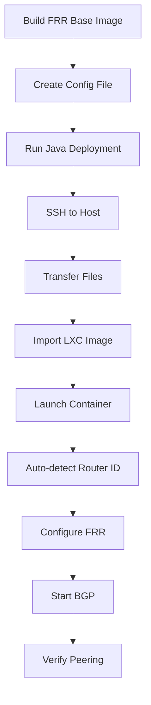

# FRR Router Deployment Guide

## Overview

FRR Router containers provide BGP/OSPF routing capabilities for announcing LXC container subnets to external networks.

### Key Features
- **Host Networking Mode**: Container shares host's network namespace
- **Minimal Configuration**: Only BGP ASN, neighbors, and networks required
- **Auto-Detection**: Router ID automatically detected from host's external IP
- **Java Automation**: Complete deployment automation via Java
- **No Port Forwarding Needed**: Direct BGP peering on host's external IP

## Architecture

```
Host (10.255.246.173)
├── LXC Bridge (lxdbr0)
│   └── Containers (10.10.199.0/24)
└── FRR Router Container (HOST NETWORK MODE)
    └── BGP Process
        ├── Peers with: 10.255.246.174, 10.255.246.175
        └── Announces: 10.10.199.0/24
```

## Quick Start

### 1. Build Container Image

```bash
cd /home/mustafa/telcobright-projects/orchestrix-frr-router/images/lxc/frr-router
./buildFrrRouter.sh
```

This creates `frr-router-base-v.1.0.0` image with FRR 10.x installed.

### 2. Create Configuration

Minimal config file (`node1-config.conf`):

```bash
CONTAINER_NAME="frr-router-node1"
BASE_IMAGE="frr-router-base-v.1.0.0"

# BGP Configuration
BGP_ASN="65001"
BGP_NEIGHBORS="10.255.246.174:65002,10.255.246.175:65003"
BGP_NETWORKS="10.10.199.0/24"
```

### 3. Deploy with Java Automation

**Deploy to single node:**
```bash
./gradlew run --args="\
  com.telcobright.orchestrix.automation.routing.frr.FrrDeploymentRunner \
  --orchestrix-path /home/mustafa/telcobright-projects/orchestrix-frr-router \
  --host 10.255.246.173 \
  --port 15605 \
  --user bdcom \
  --config deployment-configs/node1-config.conf"
```

**Deploy to all BDCOM nodes:**
```bash
./gradlew run --args="\
  com.telcobright.orchestrix.automation.routing.frr.FrrDeploymentRunner \
  --orchestrix-path /home/mustafa/telcobright-projects/orchestrix-frr-router \
  --deploy-bdcom-nodes"
```

## Configuration Reference

### Required Parameters

| Parameter | Description | Example |
|-----------|-------------|---------|
| `CONTAINER_NAME` | LXC container name | `frr-router-node1` |
| `BASE_IMAGE` | Base image name | `frr-router-base-v.1.0.0` |
| `BGP_ASN` | BGP Autonomous System Number | `65001` |
| `BGP_NEIGHBORS` | BGP peers (ip:asn,ip:asn) | `10.255.246.174:65002,10.255.246.175:65003` |
| `BGP_NETWORKS` | Networks to announce (comma-separated) | `10.10.199.0/24,192.168.1.0/24` |

### Optional Parameters (Auto-Detected)

| Parameter | Description | Default |
|-----------|-------------|---------|
| `ROUTER_ID` | Router ID | Host's external IP (auto-detected) |
| `ROUTER_HOSTNAME` | Router hostname | Same as `CONTAINER_NAME` |
| `MEMORY_LIMIT` | Container memory limit | `100MB` |
| `CPU_LIMIT` | Container CPU limit | `1` |
| `ENABLE_BGP` | Enable BGP | `true` |
| `ENABLE_OSPF` | Enable OSPF | `false` |

### OSPF Configuration (Optional)

```bash
ENABLE_OSPF="true"
OSPF_AREA="0.0.0.0"
OSPF_NETWORKS="10.10.199.0/24,192.168.1.0/24"
```

## Java Automation Classes

### FrrRouterConfig
**Package**: `com.telcobright.orchestrix.automation.routing.frr`

Parses and validates FRR router configuration files.

```java
FrrRouterConfig config = new FrrRouterConfig("node1-config.conf");
String asn = config.getBgpAsn();
String neighbors = config.getBgpNeighbors();
```

### FrrRouterDeployment
**Package**: `com.telcobright.orchestrix.automation.routing.frr`

Handles deployment to remote hosts via SSH.

```java
FrrRouterDeployment deployment = new FrrRouterDeployment("/path/to/orchestrix");
FrrDeploymentResult result = deployment.deployToNode(
    "10.255.246.173",  // host
    15605,             // port
    "bdcom",           // user
    "node1-config.conf"  // config file
);
```

**Deployment Flow**:
1. Connect to host via SSH
2. Transfer container tarball + MD5
3. Verify MD5 checksum
4. Transfer config and launch script
5. Import LXC image
6. Launch container (host networking mode)
7. Verify BGP status

### FrrDeploymentRunner
**Package**: `com.telcobright.orchestrix.automation.routing.frr`

CLI runner for executing deployments.

## Verification

### Check Container Status
```bash
ssh -p 15605 bdcom@10.255.246.173
sudo lxc list frr-router-node1
```

### Check BGP Status
```bash
sudo lxc exec frr-router-node1 -- vtysh -c 'show ip bgp summary'
```

Expected output:
```
BGP router identifier 10.255.246.173, local AS number 65001
...
Neighbor        V    AS MsgRcvd MsgSent   Up/Down State
10.255.246.174  4 65002      12      15  00:05:23     2
10.255.246.175  4 65003      10      13  00:05:19     2
```

### Check Announced Routes
```bash
sudo lxc exec frr-router-node1 -- vtysh -c 'show ip bgp'
```

### Check Received Routes
```bash
sudo lxc exec frr-router-node1 -- vtysh -c 'show ip route'
```

## Deployment Workflow



## Troubleshooting

### Container not starting
```bash
# Check LXC logs
sudo lxc info frr-router-node1 --show-log

# Check if image exists
sudo lxc image list
```

### BGP peers not connecting
```bash
# Check FRR status
sudo lxc exec frr-router-node1 -- systemctl status frr

# Check FRR logs
sudo lxc exec frr-router-node1 -- tail -f /var/log/frr/frr.log

# Verify network connectivity
sudo lxc exec frr-router-node1 -- ping 10.255.246.174
```

### Router ID not detected
Manually specify in config:
```bash
ROUTER_ID="10.255.246.173"
```

## Example Configurations

### Simple BGP Router
```bash
CONTAINER_NAME="bgp-router-1"
BASE_IMAGE="frr-router-base-v.1.0.0"
BGP_ASN="65001"
BGP_NEIGHBORS="10.255.246.174:65002"
BGP_NETWORKS="10.10.199.0/24"
```

### Announce Multiple Subnets
```bash
CONTAINER_NAME="bgp-router-multi"
BASE_IMAGE="frr-router-base-v.1.0.0"
BGP_ASN="65001"
BGP_NEIGHBORS="10.255.246.174:65002,10.255.246.175:65003"
BGP_NETWORKS="10.10.199.0/24,192.168.1.0/24,172.16.0.0/16"
```

### BGP + OSPF Combined
```bash
CONTAINER_NAME="hybrid-router"
BASE_IMAGE="frr-router-base-v.1.0.0"
BGP_ASN="65001"
BGP_NEIGHBORS="10.255.246.174:65002"
BGP_NETWORKS="10.10.199.0/24"
ENABLE_OSPF="true"
OSPF_AREA="0.0.0.0"
OSPF_NETWORKS="192.168.1.0/24"
```

## Directory Structure

```
frr-router/
├── build/
│   └── build.sh              # Build script for base image
├── deployment-configs/
│   ├── node1-config.conf     # BDCOM node 1 config
│   ├── node2-config.conf     # BDCOM node 2 config
│   └── node3-config.conf     # BDCOM node 3 config
├── templates/
│   └── sample.conf           # Configuration template
├── buildFrrRouter.sh         # Wrapper to run build
├── launchFrrRouter.sh        # Launch script (host networking)
├── DEPLOYMENT_GUIDE.md       # This file
└── README.md                 # Overview

Java Classes:
src/main/java/com/telcobright/orchestrix/automation/routing/frr/
├── FrrRouterConfig.java          # Config parser
├── FrrRouterDeployment.java      # Deployment automation
├── FrrDeploymentResult.java      # Result object
└── FrrDeploymentRunner.java      # CLI runner
```

## Prerequisites

See `PREREQUISITES.md` for:
- SSH access to target servers
- Passwordless sudo configuration
- LXC/LXD installation
- Required packages

## Support

For issues:
1. Check logs: `/var/log/frr/frr.log`
2. Verify container: `sudo lxc info <container-name>`
3. Check BGP: `vtysh -c 'show ip bgp summary'`
4. Review configuration file syntax
